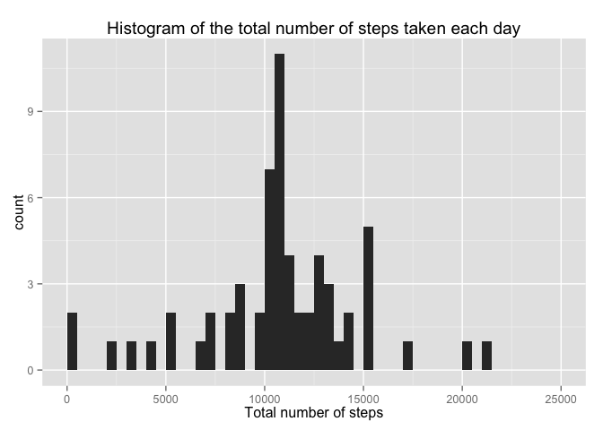

# Reproducible Research: Peer Assessment 1
## PART ONE - Loading and preprocessing the data

**1. Load the data (i.e. read.csv())**

```r
# Loads the required libraries 
require(dplyr)
```

```
## Loading required package: dplyr
## 
## Attaching package: 'dplyr'
## 
## The following object is masked from 'package:stats':
## 
##     filter
## 
## The following objects are masked from 'package:base':
## 
##     intersect, setdiff, setequal, union
```

```r
require(lattice)
```

```
## Loading required package: lattice
```

```r
# Unzips the data files
unzip("activity.zip")

# Reads the CSV file
activity <- read.csv("./activity.csv", colClasses = c("numeric", "Date", 
                                                      "numeric"), 
                     stringsAsFactors = FALSE)
```

**2. Process/transform the data (if necessary) into a format suitable for your analysis**


```r
# Transforms the data frame in a table data frame (tbl_df)
activity <- tbl_df(activity)
print(activity)
```

```
## Source: local data frame [17,568 x 3]
## 
##    steps       date interval
## 1     NA 2012-10-01        0
## 2     NA 2012-10-01        5
## 3     NA 2012-10-01       10
## 4     NA 2012-10-01       15
## 5     NA 2012-10-01       20
## 6     NA 2012-10-01       25
## 7     NA 2012-10-01       30
## 8     NA 2012-10-01       35
## 9     NA 2012-10-01       40
## 10    NA 2012-10-01       45
## ..   ...        ...      ...
```

## PART TWO - What is mean total number of steps taken per day?

**1. Make a histogram of the total number of steps taken each day**

```r
# Calculates the number of steps taken per day
daily.steps <- group_by(activity, date) %>%
  summarise(total.steps = sum(steps,na.rm = TRUE))

# Plots the histogram
histogram(~ total.steps, data = daily.steps, 
          xlab = "Total number of steps taken per day ")
```

 

**2. Calculate and report the mean and median of the total number of steps taken per day**

```r
mean.daily.steps <- mean(daily.steps$total.steps, na.rm = TRUE)
median.daily.steps <- median(daily.steps$total.steps, na.rm = TRUE)
```
* The mean of the total number of steps is 9354.2295082. 
* The median of the total number of the steps is 1.0395\times 10^{4}.


## PART THREE - What is the average daily activity pattern?

**1. Make a time series plot (i.e. type = "l") of the 5-minute interval (x-axis) and the average number of steps taken, averaged across all days (y-axis)**

```r
# Calculates the average steps by interval
steps.interval <- group_by(activity, interval) %>%
  summarize(avg.steps = mean(steps, na.rm = TRUE))

# Plots the graphic
xyplot(avg.steps ~ interval, data = steps.interval, type = "l", col = "blue", 
       main = "Time Series", xlab = "Interval", ylab = "Average number of steps")
```

 

**2. Which 5-minute interval, on average across all the days in the dataset, contains the maximum number of steps?**

```r
## Orders the steps.interval by decreased average.steps 
steps.interval <- steps.interval[order(steps.interval$avg.steps, 
                                       decreasing = TRUE), ]
## The maximum is at the first row
max.interval <- steps.interval[1, 1]
```
The interval which contains the maximum number of step is 835.


## PART FOUR - Imputing missing values

**1. Calculate and report the total number of missing values in the dataset (i.e. the total number of rows with NAs)**

```r
missing.values <- sum(is.na(activity$steps))
```
The total number of missing values is 2304.

**2. Devise a strategy for filling in all of the missing values in the dataset. The strategy does not need to be sophisticated. For example, you could use the mean/median for that day, or the mean for that 5-minute interval, etc.**

**Answer:** the strategy is filling the missing values with the mean of the 5-minute interval.


**3. Create a new dataset that is equal to the original dataset but with the missing data filled in.**

```r
activity.new <- activity
for(i in 1:dim(activity.new)[1]){
  if(is.na(activity.new$steps[i])) {
    interval.temp <- activity.new$interval[i]
    avg.steps <- filter(steps.interval, interval == interval.temp)
    activity.new$steps[i] <- avg.steps$avg.steps
  }
}
print(activity.new)
```

```
## Source: local data frame [17,568 x 3]
## 
##        steps       date interval
## 1  1.7169811 2012-10-01        0
## 2  0.3396226 2012-10-01        5
## 3  0.1320755 2012-10-01       10
## 4  0.1509434 2012-10-01       15
## 5  0.0754717 2012-10-01       20
## 6  2.0943396 2012-10-01       25
## 7  0.5283019 2012-10-01       30
## 8  0.8679245 2012-10-01       35
## 9  0.0000000 2012-10-01       40
## 10 1.4716981 2012-10-01       45
## ..       ...        ...      ...
```

**4. Make a histogram of the total number of steps taken each day and Calculate and report the mean and median total number of steps taken per day. Do these values differ from the estimates from the first part of the assignment? What is the impact of imputing missing data on the estimates of the total daily number of steps?**

```r
# Creates the new data frame of daily steps
daily.steps.new  <- group_by(activity.new, date) %>%
  summarise(total.steps = sum(steps, na.rm = TRUE))

# Plots the new histogram
histogram(~ total.steps, data = daily.steps.new,  
          xlab = "Total number of steps taken per day")
```

 

```r
# Calculates the mean, median
mean.daily.steps.new <- mean(daily.steps.new$total.steps, na.rm = TRUE)
median.daily.steps.new <- median(daily.steps.new$total.steps, na.rm = TRUE)

# Calculates the difference
diff.mean <- mean.daily.steps.new - mean.daily.steps
diff.median <- median.daily.steps.new - median.daily.steps
```
* The new mean of the total number of steps is 1.0766189\times 10^{4}. 
* The new median of the total number of the steps is 1.0766189\times 10^{4}.
* The difference of means values is: 1411.959171.
* The difference of medians values is: 371.1886792.

**Conclusion:**
The new dataset has higher values of mean and median. So, the impact of putting missing values was to increase the values of mean and median.

## PART FIVE - Are there differences in activity patterns between weekdays and weekends?

**1. Create a new factor variable in the dataset with two levels – "weekday" and "weekend" indicating whether a given date is a weekday or weekend day.**

```r
# Creates a weekday variable
activity <- mutate(activity, weekday = weekdays(date))

# Sets the variables with values "weekday" and "weekend" 
for(i in 1:dim(activity)[1]) {
  if(activity$weekday[i] == "Saturday" | activity$weekday[i] == "Sunday") {
    activity$weekday[i] <- "weekend" 
  } else {
    activity$weekday[i] <- "weekday"
  }
}

# Transforms the weekday variable in a factor
activity <- mutate(activity, weekday = as.factor(weekday))
```

**2. Make a panel plot containing a time series plot (i.e. type = "l") of the 5-minute interval (x-axis) and the average number of steps taken, averaged across all weekday days or weekend days (y-axis).**

```r
# Calculates the average number of steps by type of date and interval
steps.interval <- group_by(activity, interval, weekday) %>%
  summarize(avg.steps = mean(steps, na.rm = TRUE))

# Plots the graphics
xyplot(avg.steps ~ interval | weekday, data = steps.interval, type = "l", 
       layout = c(1, 2), ylab = "Average number of steps", 
       panel = function(x, y, ...) {
         panel.xyplot(x, y, ...)
         panel.abline(h = median(y), lty = 2)
  })
```

 
