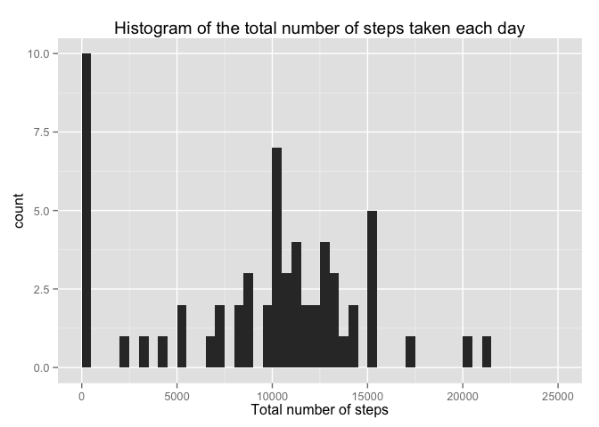

# Reproducible Research: Peer Assessment 1


## Loading and preprocessing the data

**1. Load the data (i.e. read.csv())**

```r
activity <- read.csv("./activity.csv", colClasses = c("numeric", "Date", 
                                                      "numeric"), 
                     stringsAsFactors = FALSE)
```

**2. Process/transform the data (if necessary) into a format suitable for your analysis**

```r
# Creates a time variable (POSIXct) and discard interval variable
activity$time <- strptime(activity$date, format = "%Y-%m-%d")
activity$time <- activity$time + activity$interval
```

## What is mean total number of steps taken per day?

**1. Make a histogram of the total number of steps taken each day**

```r
# Loads the dplyr library
library(dplyr)
```

```
## 
## Attaching package: 'dplyr'
## 
## The following object is masked from 'package:stats':
## 
##     filter
## 
## The following objects are masked from 'package:base':
## 
##     intersect, setdiff, setequal, union
```

```r
# Calculates the number of steps taken per day
activity <- group_by(activity, date)
daily.steps <- summarise(.data = activity, total.steps = sum(steps, 
                                                             na.rm = TRUE))
activity <- ungroup(activity)

# Plot the histogram
with (daily.steps, plot(x = date, y = total.steps, type = "h", col = "blue", 
                        main = "Steps taken per day", xlab = "Date", 
                        ylab = "Total steps"))
```

 

**2. Calculate and report the mean and median total number of steps taken per day**

```r
mean.daily.steps <- mean(daily.steps$total.steps, na.rm = TRUE)
median.daily.steps <- median(daily.steps$total.steps, na.rm = TRUE)
```
* The mean of the total number of steps is 9354.2295082. 
* The median of the total number of the steps is 1.0395\times 10^{4}.


## What is the average daily activity pattern?

**1. Make a time series plot (i.e. type = "l") of the 5-minute interval (x-axis) and the average number of steps taken, averaged across all days (y-axis)**

```r
# Calculates the average steps by interval
activity <- group_by(activity, interval)
steps.interval <- summarize(.data = activity, 
                            average.steps = mean(steps, na.rm = TRUE))
activity <- ungroup(activity)

# Plots the graphic
with(steps.interval, {
  plot(x = interval, y = average.steps, type = "l", col = "red", 
       main = "Time Series", xlab = "Time", ylab = "Average steps")
})
```

 

**2. Which 5-minute interval, on average across all the days in the dataset, contains the maximum number of steps?**

```r
## Order the steps.interval by decreased average.steps 
steps.interval <- steps.interval[order(steps.interval$average.steps, 
                                       decreasing = TRUE), ]
## The maximum is in first row
max.interval <- steps.interval[1, 1]
```
The interval which contains the maximum number of step is 835


## Imputing missing values

**1. Calculate and report the total number of missing values in the dataset (i.e. the total number of rows with NAs)**

```r
missing.values <- sum(is.na(activity$steps))
```
The total number of missing values is 2304


**2. Devise a strategy for filling in all of the missing values in the dataset. The strategy does not need to be sophisticated. For example, you could use the mean/median for that day, or the mean for that 5-minute interval, etc.**

**Answer:** the strategy is filling the missing values the mean of the 5-minute interval.


**3. Create a new dataset that is equal to the original dataset but with the missing data filled in.**

```r
activity.new <- activity
for(i in 1:dim(activity.new)[1]){
  if(is.na(activity.new$steps[i])) {
    interval.temp <- activity.new$interval[i]
    avg.steps <- filter(steps.interval, interval == interval.temp)
    activity.new$steps[i] <- avg.steps$average.steps
  }
}
```

**4. Make a histogram of the total number of steps taken each day and Calculate and report the mean and median total number of steps taken per day. Do these values differ from the estimates from the first part of the assignment? What is the impact of imputing missing data on the estimates of the total daily number of steps?**

```r
activity.new <- tbl_df(activity.new)
activity.new <- group_by(activity.new, date)
daily.steps.new <- summarise(.data = activity.new, total.steps = sum(steps, 
                                                             na.rm = TRUE))
activity <- ungroup(activity.new)

# Plots the histogram
with (daily.steps.new, plot(x = date, y = total.steps, type = "h", col = "blue", 
                        main = "Steps taken per day", xlab = "Date", 
                        ylab = "Total steps"))
```

 

```r
# Calculates the mean, median
mean.daily.steps.new <- mean(daily.steps.new$total.steps, na.rm = TRUE)
median.daily.steps.new <- median(daily.steps.new$total.steps, na.rm = TRUE)

# Calculates the difference
diff.mean <- mean.daily.steps.new - mean.daily.steps
diff.median <- median.daily.steps.new - median.daily.steps
```
* The new mean of the total number of steps is 9354.2295082. 
* The new median of the total number of the steps is 1.0395\times 10^{4}.
* The difference of means values is: 1411.959171.
* The difference of medians values is: 371.1886792.

**Conclusion:**
The new dataset has higher values of mean and median. The impact of putting missing values is to decrease the values of mean and median.

## Are there differences in activity patterns between weekdays and weekends?
